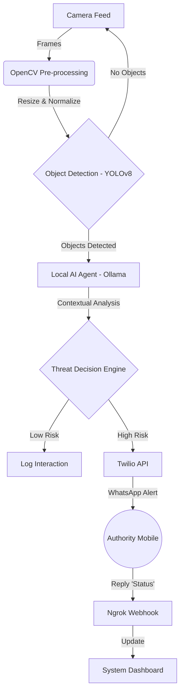

# Project Report: Multimodal Autonomous AI Surveillance System 🛡️

## 1. Executive Summary
This project presents an **Autonomous AI Surveillance System** designed to enhance public safety through real-time threat detection. unlike traditional surveillance systems that rely on constant human monitoring, this system utilizes **Multimodal AI** (combining Computer Vision and Large Language Models) to autonomously detect, analyze, and report security threats. The system integrates **YOLOv8** for object detection, **Local Vision Language Models (Moondream/Ollama)** for contextual reasoning, and **Twilio** for immediate authority alerting via WhatsApp.

---

## 2. Technology Stack

### A. Core AI & Machine Learning
| Component | Technology | Purpose |
| :--- | :--- | :--- |
| **Object Detection** | **YOLOv8 (You Only Look Once)** | Real-time detection of objects (Persons, Bags, Vehicles, Weapons) with high speed and accuracy. Running locally. |
| **Reasoning Engine** | **Local LLM via Ollama (Moondream)** | Multimodal VLM that acts as the "brain". It analyzes the scene context (e.g., distinguishing between a person waiting vs. a person loitering suspiciously). |
| **Image Processing** | **OpenCV (cv2)** | Handling video streams, frame extraction, and image pre-processing. |

### B. Application & Backend
| Component | Technology | Purpose |
| :--- | :--- | :--- |
| **Language** | **Python 3.10+** | Primary programming language for all logic and integration. |
| **Web Framework** | **Streamlit** | Rapid development of the interactive Dashboard UI for monitoring. |
| **Webhook Server** | **FastAPI + Uvicorn** | Handling incoming messages from authorities (Two-way communication). |
| **Tunneling** | **Ngrok** | Exposing the local localhost server to the internet for Twilio callbacks. |

### C. Alerting & Communication
| Component | Technology | Purpose |
| :--- | :--- | :--- |
| **SMS / WhatsApp** | **Twilio API** | Programmable messaging service to send high-priority alerts to security personnel. |

---

## 3. Methodology & System Workflow

The system operates on a **5-Stage Intelligence Pipeline**:

### Stage 1: Data Acquisition 🎥
*   **Input**: The system accepts input from live webcams, IP cameras, or pre-recorded surveillance footing.
*   **Process**: Video is captured frame-by-frame using OpenCV. To optimize performance, frames are resized (e.g., 640x480) and sampled (e.g., every 10th frame) for deep analysis.

### Stage 2: Vision Intelligence Layer (Local) 👁️
*   **Model**: YOLOv8 Nano/Small (Local Inference).
*   **Task**: Locates and classifies objects in the frame.
*   **Output**: Bounding Box coordinates `(x, y, w, h)`, Class Labels (e.g., "Person", "Backpack"), and Confidence Scores.
*   *Note: This runs entirely locally to preserve privacy and reduce latency.*

### Stage 3: Multimodal Reasoning Layer (Cloud) 🧠
*   **Trigger**: If objects are detected, the frame is sent to the **Local AI Agent (Ollama)**.
*   **Context Injection**: The system injects a prompt: *"You are a security analyst. Location is {Location_Type}. Analyze behaviour."*
*   **Reasoning**: The local VLM analyzes the visual relationships.
    *   *Example*: A bag detection is neutral. A bag left unattended in an airport for 5 minutes is a "Threat".
*   **Output**: Structured JSON containing `Classification`, `Severity`, and `Description`.

### Stage 4: Decision Engine ⚖️
*   **Logic**: A deterministic rule-based engine evaluates the AI's output.
*   **Rules**:
    *   `Severity = HIGH` → Trigger **CRITICAL ALERT**.
    *   `Severity = MEDIUM` → Log to database.
    *   `Severity = LOW` → Ignore.

### Stage 5: Response & Feedback Loop 🚨
*   **Alerting**: The system formats a message (Location, Time, Threat Description) and sends it via **Twilio WhatsApp**.
*   **Feedback**: Security personnel can reply "Ack" or "Status". The **FastAPI Webhook** captures this reply and updates the system log, closing the loop.

---

## 4. System Architecture Diagram



---

## 5. Key Algorithms / Pseudo-Code

**Threat Determination Logic:**
```python
def evaluate_threat(incident_report):
    severity = incident_report.severity
    classification = incident_report.classification
    
    if severity == "HIGH" or classification == "CRITICAL":
        trigger_twilio_alert()
        log_incident_db(status="Active")
        return "CRITICAL"
        
    elif severity == "MEDIUM":
        log_incident_db(status="Warning")
        return "WARNING"
        
    else:
        return "MONITORING"
```

---

## 6. Future Scope
1.  **Edge Deployment**: Deploying the YOLO model on Raspberry Pi/Jetson Nano for a standalone device.
2.  **Face Recognition**: Integrating `face_recognition` library to identify specific known threats or blacklisted individuals.
3.  **Audio Analytics**: Using microphones to detect screams or glass breaking to trigger the camera system.

---
*Generated for Final Year Engineering Project Documentation.*
